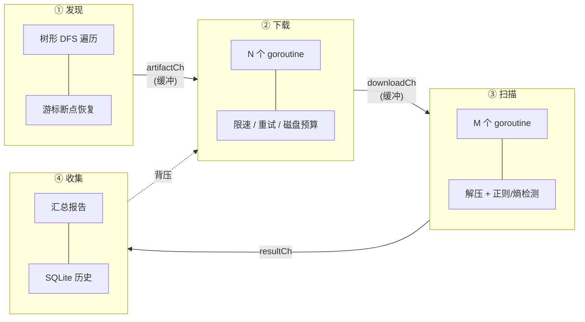

::: tip 💡 不知道从哪开始？
直接把下面的提示词复制给 AI（Claude Code / Codex），它会手把手带你完成全部流程。
:::

## 🤖 让 AI 帮你接入（一键复制）

无需阅读任何文档 —— 把下面这段提示词复制粘贴到你的 AI Agent（Claude Code 或 Codex）中，AI 会自动引导你完成安装、配置、扫描和结果解读。

### Claude Code 用户

> 在 Claude Code 中直接粘贴以下内容即可：

<div class="copy-prompt">

```text
我想使用 mvn-repo-scanner 这个工具扫描 Maven 仓库中的敏感内容泄露（密码、密钥、证书等）。

请按以下步骤引导我完成，每一步都先解释清楚再执行，遇到需要我做决策的地方给出选项和你的推荐：

1. 环境检查：检查我是否已安装 Go 1.25+（运行 `go version`）。若未安装，告诉我如何安装。
2. 安装工具：从 GitHub 克隆 https://github.com/scagogogo/mvn-repo-scanner 并编译出二进制 `mvn-repo-scanner`，验证 `./mvn-repo-scanner version` 可正常运行。
3. 了解需求：询问我要扫描哪个 Maven 仓库（中央仓库 repo.maven.apache.org 还是私服 URL）、是否需要按 groupId 过滤、想用哪档规则集（core/extended/all，默认 core）。
4. 首次小范围试扫：先用一个小的 groupId（例如 javax.inject）做一次小范围扫描，确认工具能正常工作，例如：
   `./mvn-repo-scanner scan --repo https://repo.maven.apache.org/maven2 --group javax.inject --rules-level core -v`
   观察输出，向我解释 Discovered / Scanned / Failed / Findings 各项含义。
5. 正式扫描：根据我的需求配置完整命令。如果是大型仓库，提醒我使用 --state-file 保存进度、--concurrency 控制并发、--checkpoint-interval 控制存盘频率，并解释 --resume 断点续扫的用法。
6. 结果解读：扫描结束后，如有 Findings，逐条解释每条发现对应的规则、严重级别（CRITICAL/HIGH/MEDIUM/LOW）、所在文件与匹配内容，并给出处置建议。
7. （可选）定时任务：如果我希望周期性扫描，介绍 --scan-interval 和 --task-id 的用法，以及 `task list/run/pause/resume` 等命令，帮我注册一个任务。

执行过程中如遇到报错，主动排查并修复。全程用简体中文回复。
```

</div>

### Codex（OpenAI）用户

> 在 Codex 中直接粘贴以下内容即可：

<div class="copy-prompt">

```text
我要用 mvn-repo-scanner（GitHub: https://github.com/scagogogo/mvn-repo-scanner）扫描 Maven 仓库的敏感内容泄露。

请作为我的安全扫描助手，分步骤引导我完成，每步先说明意图再执行，关键决策点给我选项和推荐理由：

步骤 1 环境检查：运行 `go version` 确认 Go 1.25+，缺失则指导安装。
步骤 2 安装：clone 仓库并 `go build -o mvn-repo-scanner ./cmd/mvn-repo-scanner`，运行 `./mvn-repo-scanner version` 验证。
步骤 3 需求确认：询问目标仓库（中央仓库或私服 URL）、groupId 过滤范围、规则集档位（core/extended/all，默认 core）。若扫描私服，询问认证方式（Basic Auth 用户名密码 / Bearer Token）。
步骤 4 小范围试扫：先用 `./mvn-repo-scanner scan --repo https://repo.maven.apache.org/maven2 --group javax.inject -v` 验证可用性，解释输出各字段。
步骤 5 正式扫描：按我的需求组装命令，对大型仓库启用 --state-file、--checkpoint-interval、--concurrency，并说明 --resume 如何在中断后继续、--retry-failed 如何重试失败项。
步骤 6 结果解读：扫描完成后解读 Findings（规则、严重级别、文件路径、匹配内容），给出修复建议。
步骤 7（可选）周期扫描：用 --scan-interval 与 --task-id 注册定时任务，演示 task list / task run / task pause 命令。

遇错主动修复。全程简体中文。
```

</div>

::: details 📋 不想用 AI？看命令行快速上手
```bash
# 1. 编译
git clone https://github.com/scagogogo/mvn-repo-scanner
cd mvn-repo-scanner
go build -o mvn-repo-scanner ./cmd/mvn-repo-scanner

# 2. 扫描 Maven Central 的某个 groupId
./mvn-repo-scanner scan \
  --repo https://repo.maven.apache.org/maven2 \
  --group com.example \
  --rules-level core \
  --concurrency 10 \
  --state-file .mvn-scan-state.json

# 3. 中断后断点续扫
./mvn-repo-scanner scan --resume --state-file .mvn-scan-state.json

# 4. 扫描私有仓库（Basic Auth）
./mvn-repo-scanner scan \
  --repo https://nexus.example.com/repository/maven-public \
  --auth-username admin --auth-password '***' \
  --group com.internal

# 5. 注册每小时定时扫描任务
./mvn-repo-scanner scan --group com.example --scan-interval 1h --task-id hourly-scan
./mvn-repo-scanner task list
```
:::

## 这个工具解决什么问题？

Maven 仓库（无论是公开的 Maven Central，还是企业内部的 Nexus / Artifactory 私服）里堆积着成千上万个 artifact。其中很多 jar 包内部的配置文件、`pom.xml`、`settings.xml` 里，**意外地硬编码了数据库密码、云厂商密钥、第三方 Token、私钥证书**——这些一旦泄露，轻则内部系统被入侵，重则云账户被盗用产生巨额账单。

传统的人工审计根本无法应对这种规模：一个中等规模的私服就有上万个 artifact，每个 jar 解压后又有几十上百个文件。`mvn-repo-scanner` 就是用来**自动化、可中断、可恢复地**完成这件事：

- **自动遍历**整个仓库的 `groupId/artifactId/version/` 目录树
- **解压 jar/war/ear**，扫描内部的 `.properties`、`.xml`、`.yml`、`.json` 等文本文件
- **正则匹配** 37 类敏感信息模式，按 CRITICAL/HIGH/MEDIUM/LOW 分级
- **断点续扫**，扫到一半中断了，下次从断点继续，不重扫不漏扫
- **定时调度**，周期性监控仓库新发布的 artifact

## 它是如何解决的？



1. **发现阶段**用基于游标的有序 DFS 遍历目录树，把游标（一个深度=树深度的栈）持久化到 JSON，中断后从游标恢复，**只需 O(树深度) 状态而非 O(节点数)**。
2. **下载/扫描阶段**用 goroutine 并发，通道背压控制，支持 QPS 限速和磁盘预算。
3. **检测阶段**对每个文件应用启用的规则集（正则引擎 + 熵引擎），命中即记录严重级别与匹配内容。
4. **收集阶段**汇总到内存报告 + SQLite 历史，支持 console / JSON 输出。

想深入了解每个环节的设计权衡，请看 [工作原理](/principle/overview)。

## 下一步

- [快速开始](/guide/getting-started) — 5 分钟跑通第一次扫描
- [检测规则](/guide/rules) — 看看能检测哪些敏感信息
- [断点续扫](/guide/resume) — 大型仓库如何分批扫完
- [工作原理](/principle/overview) — 为什么这样设计

<style>
.copy-prompt {
  position: relative;
  margin: 16px 0;
}

.copy-prompt details,
.copy-prompt div {
  position: relative;
}

/* 提示词区块视觉提示 */
.copy-prompt pre {
  border-left: 3px solid var(--vp-c-brand-1);
}
</style>
