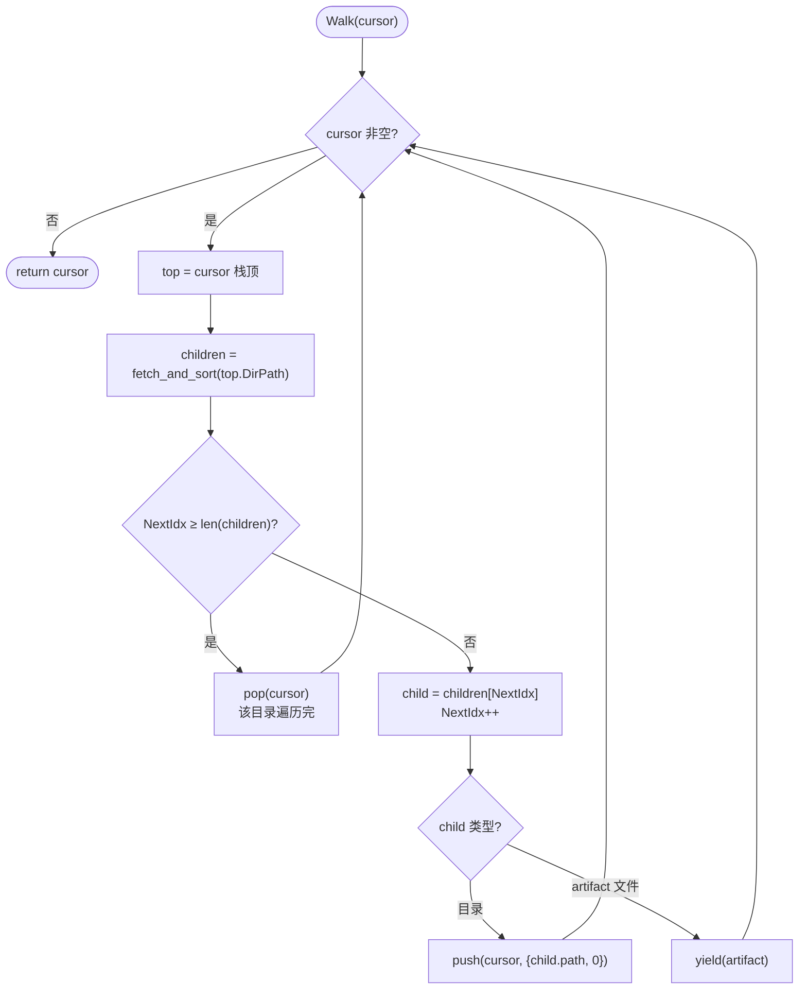
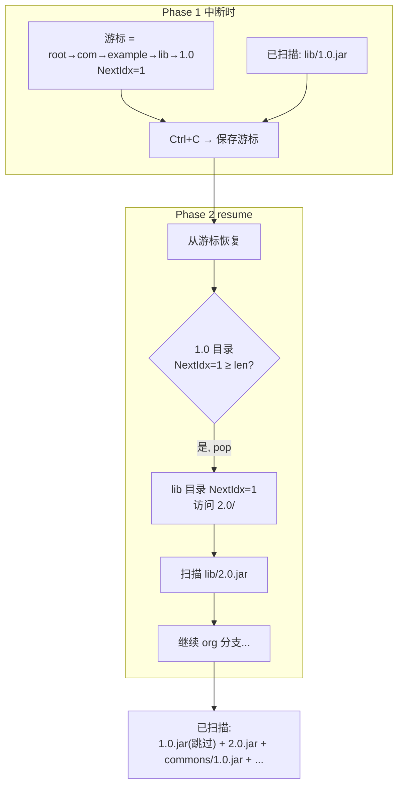
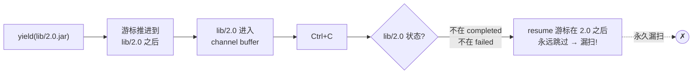
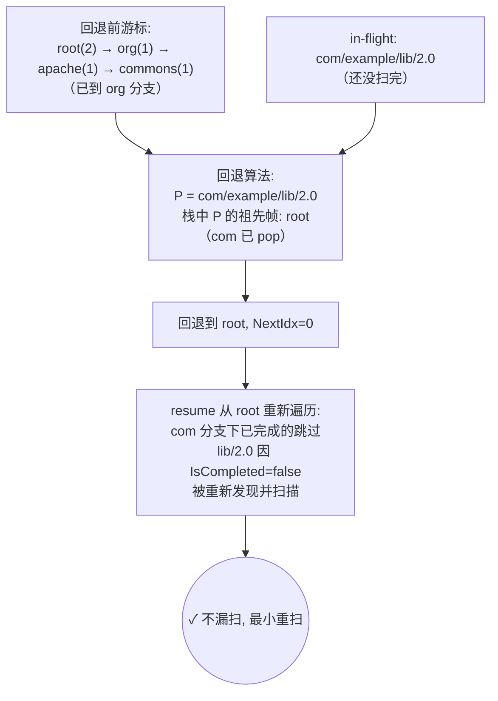

# 树形遍历与游标恢复

这是 `mvn-repo-scanner` 断点续跑能力的核心算法。它解决了两个问题：**如何高效遍历仓库目录树**，以及**如何在中断后从断点恢复而不漏扫不重扫**。

## 问题背景

Maven 仓库是一个层级目录树：

```text
repo/
├── com/
│   └── example/
│       └── lib/
│           ├── 1.0/
│           │   └── lib-1.0.jar   ← artifact 文件
│           └── 2.0/
│               └── lib-2.0.jar
└── org/
    └── apache/
        └── commons/
            └── 1.0/
                └── commons-1.0.jar
```

要扫描整个仓库，需要遍历这棵树，访问每个叶子目录下的文件。问题是：

1. **树很大** — Maven Central 有数百万节点，全部缓存到内存不现实
2. **遍历可中断** — 扫到一半可能被 Ctrl+C 或机器重启打断
3. **恢复要精确** — 既不能漏扫（安全漏洞），也不能重扫（浪费资源）

## 为什么不用 BFS（广度优先）？

直觉上 BFS"展开的节点少"，似乎更省内存。但实际测试发现：

- BFS 的队列保存**当前层所有待访问节点**，对于宽树（Maven 仓库的 `com/`、`org/` 下有成千上万子目录），队列会膨胀到接近叶子数量（实测可达 10 万+）
- DFS 的栈只保存**当前路径**，深度 = 树深度（约 7-8 层），与树宽度无关

| 遍历方式 | 状态量 | Maven Central 实测 |
|---------|--------|-------------------|
| BFS 队列 | O(树宽度) | ~10万节点，数百 KB-MB |
| DFS 栈 | O(树深度) | ~7-8 层，几百字节 |
| **游标 DFS** | **O(树深度)** | **~7-8 层，几百字节，可序列化** |

结论：**基于游标的有序 DFS 最优**，状态量 = O(树深度)，与树规模无关。

## 游标的设计

游标是一个**栈**，每个帧记录"当前在哪个目录、要访问第几个子节点"：

```go
type CursorFrame struct {
    DirPath string  // 目录路径，如 "com/example/lib"
    NextIdx int     // 下一个要访问的子节点索引
}
type Cursor []CursorFrame  // 栈，栈顶是当前目录
```

### 遍历算法



### 关键：客户端排序

`fetch_and_sort` 会**在客户端对子节点按名字排序**，而不是依赖服务器返回的顺序。因为不同服务器（Apache、Nexus、Artifactory）返回顺序可能不同，只有客户端排序才能保证 `NextIdx` 在不同运行间稳定，游标才能正确恢复。

### 游标语义

游标的 `NextIdx` 是"**下一个要访问的子节点索引**"。保存游标后，下次从同一游标恢复，会从 `NextIdx` 继续——既不会重复访问已访问的，也不会跳过未访问的。

## 断点恢复

### 普通断点

中断时保存游标，resume 时从游标继续：



`IsCompleted(path)` 检查让 resume 时跳过已完成的 artifact，即使游标位置覆盖到它们也无害。

### in-flight 保护的难题

朴素游标恢复有个陷阱：**artifact 被 yield 到 channel 后游标立即推进，但扫描是异步的**。如果中断时某个 artifact 已被 yield（游标已越过它）但还没扫完（既不在 completed 也不在 failed），resume 时游标已在它后面，**会永久漏扫**。



### 解决：yield 前 MarkInFlight + 游标回退

工具用两层保护解决这个难题：

**1. yield 前先 MarkInFlight**

```go
yield = func(a Artifact) {
    if IsCompleted(a.Path()) { return }
    state.MarkInFlight(a.Path())    // ← 先标记 in-flight（持久化）
    artifactCh <- a                  // 再交付 channel
}
```

这样所有已交付但未完成的 artifact 都在 `in_flight_artifacts` 集合里（持久化到 JSON）。

**2. 保存游标时回退到 in-flight 之前**

保存游标前，调用 `rollbackForInFlight`：对每个 in-flight artifact 路径 P，在游标栈中找它的祖先帧，把游标截断到最浅的覆盖性祖先帧，`NextIdx` 置 0：



这样即使游标已越过 in-flight artifact，回退后 resume 会重新遍历到它。已完成的被 `IsCompleted` 跳过，只有 in-flight 的会被重新处理——**不漏扫，最小重扫**。

## 游标的内存与序列化优势

- **内存**：游标栈深度 = 当前树深度（Maven 仓库约 7-8 层），每帧几十字节，总计几百字节
- **序列化**：JSON 序列化后约几百字节到 1KB，远小于缓存完整 artifact 列表（Maven Central 全量可达数 MB）

对比三种方案的真实成本：

| 方案 | 状态大小（Maven Central 规模） |
|------|------------------------------|
| 缓存完整 discovered 列表 | ~2.9 MB |
| DFS + visited 集合 | ~390 KB |
| **游标** | **~700 字节** |

## 与批量发现的对比

工具同时支持两种发现模式：

- **流式发现**（默认，`discoverStreaming`）— 游标遍历，边发现边扫描，发现阶段本身可断点恢复
- **批量发现**（`discoverBatched`，旧模式）— 先发现全部 artifact 缓存到内存/磁盘，再扫描

流式发现的优势：发现阶段不占用大量内存，且可中断恢复；劣势：发现结果不缓存（除非用 discovery cache）。工具默认流式，兼顾内存与可恢复性。

## 小结

游标式有序 DFS 是大型树形结构断点续跑的最优解：

- **O(树深度) 状态**，与树规模无关
- **客户端排序**保证游标稳定性
- **yield 前 MarkInFlight + 游标回退**保证不漏扫 in-flight artifact
- **IsCompleted 跳过**保证不重扫已完成 artifact

这套机制让 `mvn-repo-scanner` 能在 Maven Central 这种超大规模仓库上安全地分批扫描、中断恢复。

## 相关代码

- `internal/repo/cursor_walker.go` — 游标遍历器
- `internal/scanner/scanner.go` 的 `discoverStreaming` / `saveCursorFrom` / `rollbackForInFlight` — 流式发现与游标回退
- `internal/state/state.go` — `in_flight_artifacts` / `discovery_cursor` 持久化

## 下一步

- [四阶段流水线](./pipeline) — 游标产出的 artifact 如何被并发扫描
- [持久化与任务管理](./persistence) — 游标如何序列化到 JSON
