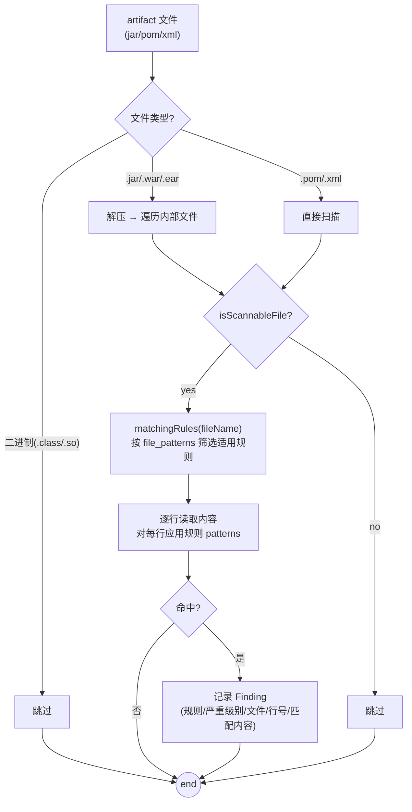
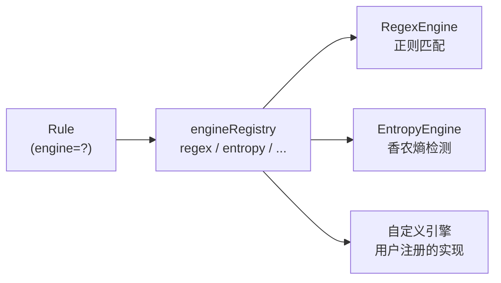
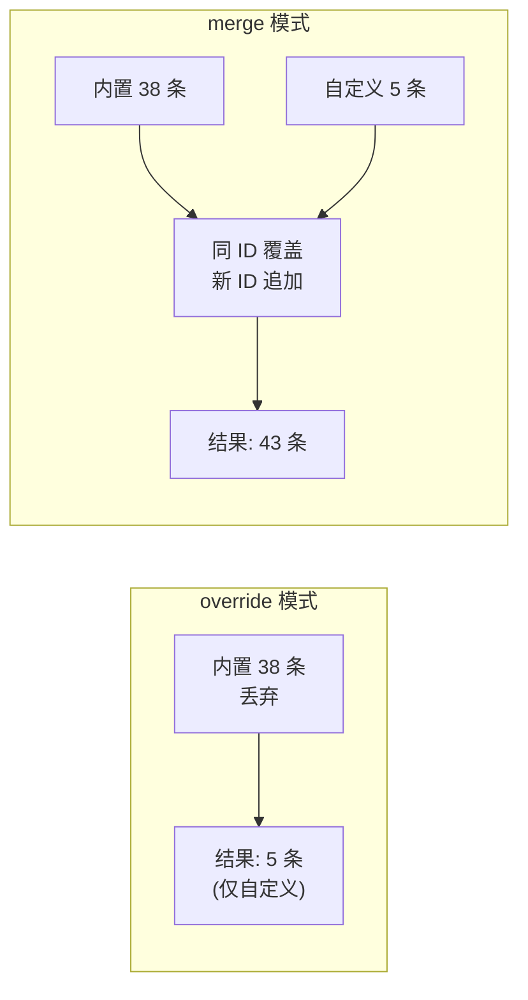

# 敏感内容检测

`mvn-repo-scanner` 的检测引擎基于**正则规则匹配**，对 artifact 内的文本文件应用规则集，识别密码、密钥、证书等敏感信息。

## 检测流程



## 多引擎架构

检测能力不再只靠正则。`Detector` 持有一个**引擎注册表**，每条规则声明用哪个引擎执行，扫描时按 `rule.Engine` 分派：



内置两个引擎：

| 引擎 | 适用场景 | 工作方式 |
|------|---------|---------|
| `regex`（默认） | 已知格式的凭证（AWS Key、GitHub Token、PEM 私钥） | 编译正则，逐行 `FindAllStringSubmatch` |
| `entropy` | 无固定格式的高随机性密钥（ unnamed service token） | 滑动窗口计算香农熵，超阈值即报告 |

熵引擎解决的是正则覆盖不到的盲区——一个没有任何已知前缀的随机密钥，正则规则无法匹配，但它的**信息熵**显著高于自然语言或普通配置值。代价是误报率较高，因此默认 `MEDIUM` 级别并配 `allowlist` 排除占位符。

```go
// internal/detector/engine.go
type RuleEngine interface {
    Name() EngineName
    Compile(rule *Rule) error
    Match(line string, rule *Rule, filePath string, lineNum int) []Finding
}
```

新增引擎只需实现接口并通过 `detector.WithEngine(e)` 注册，规则 YAML 里写 `engine: my-engine` 即可路由过去——无需改动 scanner 或 cmd 层。每条 Finding 记录 `engine_name` 字段，便于审查时按引擎来源加权判断。

## 规则叠加：merge vs override

`--rules` 加载自定义规则时有两种模式：

```bash
# override（默认）：自定义规则完全替换内置规则集
./mvn-repo-scanner scan --rules my-rules.yaml

# merge：自定义规则按 ID 叠加到内置规则上，同 ID 覆盖、新 ID 追加
./mvn-repo-scanner scan --rules my-rules.yaml --rules-merge --rules-level all
```



merge 适合"内置规则 + 几条公司内部 Token 规则"的场景，不必把 38 条内置规则全复制进 YAML。`MergeRules(builtin, custom)` 按 ID 去重：同 ID 时 custom 覆盖 builtin 的字段（例如把某条规则的 severity 从 HIGH 降到 MEDIUM），不同 ID 则追加。

resume 时会校验 `rules_file` 与 `rules_merge` 与上次一致，避免中途切换规则配置导致结果不可比。

## 规则结构

每条规则是一个正则模式集合，绑定到特定文件类型：

```yaml
- id: hardcoded-password
  name: Hardcoded Password
  severity: CRITICAL
  description: "Detects hardcoded passwords in configuration files"
  patterns:
    - '(?i)(password|passwd|pwd)\s*[=:]\s*["\x27]?[^\s"\x27{}]{6,}'
  file_patterns:
    - '\.properties$'
    - '\.xml$'
    - '\.ya?ml$'
    - '\.json$'
    - '\.conf$'
  enabled: true
```

| 字段 | 作用 |
|------|------|
| `id` | 规则唯一标识 |
| `severity` | CRITICAL / HIGH / MEDIUM / LOW |
| `patterns` | 正则数组，任一匹配即命中 |
| `file_patterns` | 文件名正则数组，文件名匹配其中之一才应用该规则 |
| `enabled` | 是否启用 |

## 文件类型过滤

`file_patterns` 让规则只作用于相关文件，避免误报：

- `hardcoded-password` 只扫 `.properties/.xml/.yml/.json/.conf`（配置文件才有密码字段）
- `aws-secret-key` 扫描所有文件（`.+$`），因为密钥可能出现在任何地方
- `private-key` 扫描所有文件，匹配 PEM 头

### 可扫描文件类型

工具只扫描文本类文件，跳过二进制。jar 内部可扫描的扩展名包括：

| 类别 | 扩展名 |
|------|--------|
| 配置 | `.properties` `.xml` `.yml` `.yaml` `.json` `.conf` `.cfg` `.ini` `.config` `.toml` `.env` |
| 密钥证书 | `.pem` `.key` `.p12` `.jks` `.pfx` |
| 脚本 | `.sh` `.bat` `.cmd` `.ps1` |
| 源代码 | `.java` `.kt` `.groovy` `.scala` |
| 文本 | `.txt` `.md` `.rst` |
| 构建配置 | `.gradle` `.mvn` `.npmrc` |
| 云配置 | `.dockerfile` `.policy` |
| 备份 | `.bak` `.orig` `.old` |

二进制文件（`.class` `.so` `.dll` `.png` 等）自动跳过。

## JAR 解压扫描

`.jar` / `.war` / `.ear` 本质是 ZIP 压缩包。工具用 `archive/zip` 解压后扫描内部文件：

```go
r, _ := zip.OpenReader(archivePath)
for _, f := range r.File {
    if !isScannableFile(f.Name) { continue }
    rc, _ := f.Open()
    findings := detector.ScanContent(rc, f.Name)
    // ...
}
```

这是关键能力——**很多泄露发生在 jar 内部的配置文件里**（如打包进 jar 的 `application.properties`、`META-INF` 下的配置），仅扫描 pom.xml 是发现不了的。

## 规则集分档

规则按重要性与通用性分三档：

| 档位 | 数量 | 内容 |
|------|------|------|
| `core` | 6 | 最高频、最低误报：硬编码密码、AWS Key、PEM 私钥、JDBC 凭证、GitHub Token、通用 API Key |
| `extended` | 32 | 扩展云厂商与服务：GCP/Azure/Google/Slack/Stripe/SendGrid 等，含 1 条熵检测规则 |
| `all` | 38 | 全部规则，含 Maven settings 密码、GPG passphrase、Docker Registry 认证等 |

```go
// internal/detector/rules.go — DefaultRules() 返回 6 条 core
// internal/detector/rules_ext.go — 扩展规则（含 1 条 entropy 引擎规则）
// merge=true 时自定义规则按 ID 叠加到内置规则上，false 时完全覆盖
func LoadRulesWithLevel(file string, level string, merge bool) ([]*Rule, error)
```

档位选择是性能与覆盖度的权衡：core 快但可能漏，all 全但略慢且误报可能多。

## 严重级别语义

| 级别 | 判定依据 | 处置优先级 |
|------|---------|-----------|
| CRITICAL | 直接可利用的高危凭证（私钥、Stripe Key、硬编码密码、Maven settings 密码） | 立即轮换 |
| HIGH | 云厂商密钥、数据库凭证、第三方服务 Token | 尽快轮换 |
| MEDIUM | 可能可利用或需上下文（通用 API Key、Bearer Token、Redis 连接串） | 评估后处置 |
| LOW | 较低风险信息 | 记录观察 |

## 自定义规则

通过 `--rules` 指定 YAML 文件。默认覆盖内置规则集；加 `--rules-merge` 则按 ID 叠加到内置规则上。

### 正则规则

```yaml
rules:
  - id: my-company-token
    name: My Company Internal Token
    severity: HIGH
    description: "Detects our internal service tokens"
    engine: regex            # 可省略，默认即 regex
    patterns:
      - 'MYTOKEN-[A-Za-z0-9]{32}'
    file_patterns:
      - '\.properties$'
      - '\.ya?ml$'
    ignorecase: true         # 等价于在 patterns 里加 (?i)
    capture_group: 0         # 报告哪个分组作为 Match（0=整条匹配）
    allowlist:               # 命中后若是这些占位符则抑制，减误报
      - 'MYTOKEN-TEST'
      - 'example'
    tags: [internal, token]
    enabled: true
```

### 熵检测规则

```yaml
rules:
  - id: my-high-entropy-secret
    name: High Entropy Secret
    severity: MEDIUM
    engine: entropy          # 用熵引擎而非正则
    description: "Flag random-looking base64 strings that match no known format"
    file_patterns:
      - '\.properties$'
      - '\.ya?ml$'
      - '\.json$'
    entropy:
      threshold: 4.5          # bits/char，≥4.5 视为可疑
      window: 32              # 滑动窗口长度（≥token 长度则整体评分）
      min_length: 24          # 忽略短于 24 字符的 token
      charset: base64         # base64 | hex | ascii
    allowlist: [example, test, changeme]
    enabled: true
```

### 高级字段总览

| 字段 | 引擎 | 作用 |
|------|------|------|
| `engine` | 全部 | 选择引擎：`regex`（默认）/`entropy`/自定义 |
| `patterns` | regex | 正则数组，任一匹配即命中 |
| `ignorecase` | regex | 编译期加 `(?i)`，免去逐条手写 |
| `capture_group` | regex | 报告指定分组为 Match，避免把整行当结果 |
| `entropy` | entropy | 阈值/窗口/最小长度/字符集 |
| `allowlist` | 全部 | 命中值若是占位符（example/test）则抑制 |
| `min_length`/`max_length` | 全部 | 约束 Match 长度，减误报 |
| `tags` | 全部 | 自由分类标签，便于按类启停 |
| `file_patterns` | 全部 | 文件名正则，决定规则作用于哪些文件 |

指定 `--rules` 不加 `--rules-merge` 时，自定义规则完全覆盖 `--rules-level` 档位；加 `--rules-merge` 则按 ID 叠加。

## 检测引擎实现

```go
// internal/detector/detector.go

type Detector struct {
    rules   []*Rule
    engines *engineRegistry   // regex + entropy + 用户注册的自定义引擎
}

// 按文件名筛选适用规则（file_patterns 匹配）
func (d *Detector) matchingRules(filePath string) []*Rule

// 对内容流应用规则，逐行扫描
func (d *Detector) scanReader(reader io.Reader, filePath string, rules []*Rule) ([]Finding, error)
```

规则在加载时编译正则（`compile`），运行时直接用编译好的 `*regexp.Regexp` 匹配，避免重复编译开销。

## 误报与处置

正则匹配难免有误报（如测试数据中的假密码）。建议处置流程：

1. 看 `severity`，CRITICAL/HIGH 优先核实
2. 看 `line_content` 与 `match`，判断是否真实凭证
3. 看所在 artifact 与文件路径，是否为测试 jar（如 `*-test.jar`）
4. 确认真泄露后：**轮换密钥**（而非仅删除文件，因为可能已被使用）+ 改用环境变量注入

## 相关代码

- `internal/detector/rules.go` / `rules_ext.go` — 规则定义
- `internal/detector/detector.go` — 检测引擎
- `internal/scanner/scanner.go` 的 `scanArchive` / `isScannableFile` — 解压与文件过滤

## 下一步

- [检测规则](/guide/rules) — 完整规则列表
- [持久化与任务管理](./persistence)
