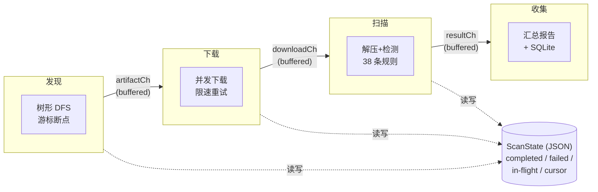

# 总体架构

`mvn-repo-scanner` 用 Go 实现，核心是一个**四阶段并发流水线**，配合**游标式目录树遍历**和**多层持久化**，实现对大型 Maven 仓库的高效、可中断、可恢复扫描。

## 设计目标

1. **可中断** — 大型仓库扫描耗时长，必须能安全中断、断点续跑，不重扫不漏扫
2. **高效** — 并发下载与扫描，充分利用带宽与 CPU，但可限速避免压垮仓库
3. **省内存** — 不把整个仓库的 artifact 列表缓存到内存，流式发现
4. **可恢复** — 状态持久化到 JSON（扫描进度）+ SQLite（任务与历史），跨进程续跑
5. **可扩展** — 规则、浏览器、下载器、检测器均为接口，可替换

## 分层结构

```text
cmd/                    命令行入口（cobra）
  ├─ scan.go            scan 命令：组装流水线、信号处理、任务持久化
  ├─ task.go            task 子命令：list/show/pause/resume/delete/run
  ├─ history.go         历史查看
  ├─ rules.go           规则列表
  └─ root.go            全局配置

internal/
  ├─ config/            配置定义与校验
  ├─ repo/              仓库访问层
  │   ├─ browser.go     目录树浏览 + 认证
  │   ├─ cursor_walker.go  游标式有序 DFS 遍历器
  │   ├─ downloader.go  artifact 下载 + 认证 + 重试
  │   └─ parser.go      HTML 目录列表解析
  ├─ detector/          敏感内容检测
  │   ├─ rules.go       core 规则（6 条）
  │   ├─ rules_ext.go   extended 规则（扩展到 38 条）
  │   └─ detector.go    正则匹配引擎
  ├─ scanner/           流水线编排
  │   ├─ scanner.go     四阶段流水线 + 断点续跑逻辑
  │   ├─ disk_watcher.go  磁盘预算与背压控制
  │   └─ result.go      扫描结果与状态类型
  ├─ state/             JSON 状态管理（断点续跑）
  ├─ storage/           SQLite 持久化（历史 + 任务）
  │   ├─ sqlite.go      scan_records / findings 表
  │   ├─ tasks.go       scan_tasks 表与任务调度
  │   └─ workspace.go   ~/.mvn-repo-scanner 目录管理
  └─ report/            报告生成（console/JSON）

configs/rules.yaml      自定义规则示例
tests/integration/      集成测试
```

## 核心抽象接口

scanner 通过四个接口解耦各个阶段，便于测试时用 mock 替换：

```go
// 发现：遍历仓库目录树，产出 artifact
type ArtifactBrowser interface { ... }

// 下载：把 artifact 文件下载到本地临时文件
type ArtifactDownloader interface {
    Download(ctx, artifact) (*DownloadResult, error)
}

// 检测：对文件内容应用规则
type ContentDetector interface {
    Detect(content, filename) []Finding
}

// 状态：记录扫描进度，支持断点续跑
type StateTracker interface {
    IsCompleted(path) bool
    MarkCompleted(path) error
    MarkInFlight(path)
    GetInFlightPaths() []string
    // ...
}
```

测试时可用 mock fetcher / mock downloader / mock detector 注入，无需真实网络。

## 数据流



四个阶段用 Go channel 连接，channel 带缓冲实现背压：上游产太快会被 channel 满阻塞，避免 OOM。

## 两条持久化线

| 持久化 | 位置 | 内容 | 用途 |
|--------|------|------|------|
| JSON 状态文件 | `--state-file`（默认 `.mvn-scan-state.json`） | 已扫 artifact、失败项、in-flight、发现游标、配置快照 | 断点续扫 |
| SQLite 数据库 | `~/.mvn-repo-scanner/scan.db` | 扫描历史记录（scan_records + findings 表）+ 任务记录（scan_tasks 表） | 历史查询、任务调度 |

两者职责分离：JSON 状态文件轻量、频繁更新（断点续跑用）；SQLite 存历史与任务元数据（查询与管理用）。

## 关键设计权衡

### 为什么用游标而不是缓存完整 artifact 列表？

Maven Central 有数百万 artifact，缓存完整列表需要数百 MB 内存且 resume 时要重新加载。游标只记录"遍历到哪个目录的哪个子节点"，状态量 = O(树深度)（约 7-8 层），几百字节即可恢复。详见 [树形遍历与游标恢复](./cursor)。

### 为什么用 channel 流水线而不是批量？

批量模式（先发现全部再扫描）对大型仓库不现实——发现阶段就要跑很久且无法中断。流式流水线边发现边扫描，发现阶段本身也用游标断点恢复，整个流程随时可中断。详见 [四阶段流水线](./pipeline)。

### 为什么 in-flight 集合很重要？

中断时，"已交付给下载但未扫完"的 artifact 既不在 completed 也不在 failed，如果不专门记录，resume 时会被游标跳过导致漏扫。工具在 yield 前 MarkInFlight，并在保存游标时回退到 in-flight artifact 之前，确保不漏。详见 [树形遍历与游标恢复](./cursor)。

## 后续阅读

- [树形遍历与游标恢复](./cursor) — 断点续跑的核心算法
- [四阶段流水线](./pipeline) — 并发与背压
- [敏感内容检测](./detection) — 规则引擎
- [持久化与任务管理](./persistence) — JSON + SQLite
