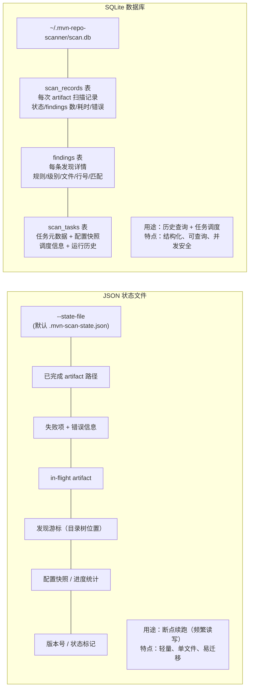
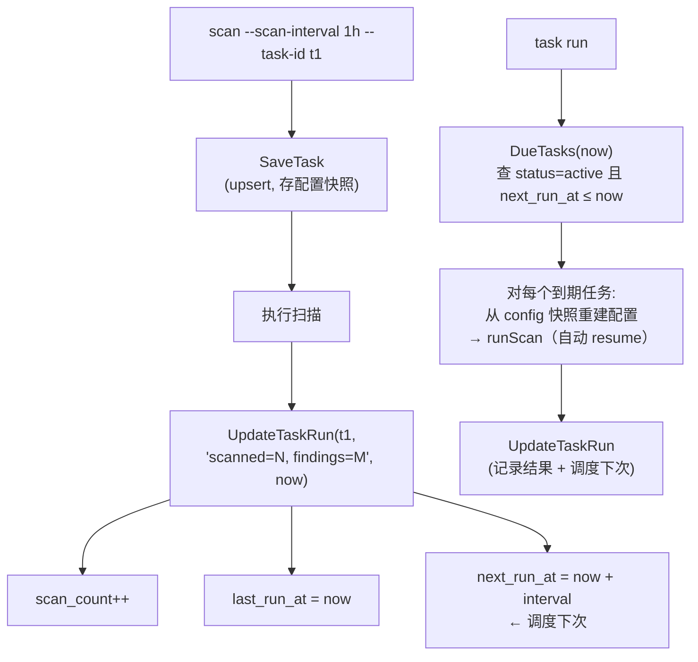

# 持久化与任务管理

`mvn-repo-scanner` 用两层持久化支撑断点续跑与任务调度：**JSON 状态文件**（扫描进度）和 **SQLite 数据库**（历史记录与任务管理）。

## 两层持久化概览



## JSON 状态文件

### 职责

记录扫描的**实时进度**，用于中断后续跑。每次扫描时频繁读写（按 `--checkpoint-interval` 频率）。

### 结构

```json
{
  "version": 1,
  "scan_id": "scan-20260701-120000",
  "status": "interrupted",
  "repo_url": "https://repo.maven.apache.org/maven2",
  "group_filter": "com.example",
  "config_snapshot": {
    "repo_url": "https://repo.maven.apache.org/maven2",
    "group_filter": "com.example",
    "rules_level": "core",
    "max_file_size": "50MB"
  },
  "completed_artifacts": ["com/example/lib/1.0", "com/example/lib/2.0"],
  "failed_entries": [
    {"path": "com/example/bad/1.0", "error": "download: 404", "retries": 3}
  ],
  "in_flight_artifacts": ["com/example/lib/3.0"],
  "discovery_cursor": [
    {"dir_path": "com/example/lib", "next_idx": 2}
  ],
  "total_discovered": 320,
  "total_scanned": 280,
  "total_failed": 2,
  "max_retries": 3,
  "checkpoint_interval": 50,
  "created_at": "2026-07-01T12:00:00+08:00",
  "updated_at": "2026-07-01T12:05:30+08:00"
}
```

### 关键字段

| 字段 | 作用 |
|------|------|
| `version` | 格式版本号，未来格式变更时做兼容 |
| `status` | `running` / `completed` / `interrupted` — 区分扫描是否正常结束 |
| `completed_artifacts` | 已成功扫描的路径集合（resume 时跳过） |
| `failed_entries` | 失败项 + 错误 + 重试次数（`--retry-failed` 时重试） |
| `in_flight_artifacts` | 中断时正在处理的项（resume 时重新扫描，防止漏扫） |
| `discovery_cursor` | 目录树遍历游标（详见[游标恢复](./cursor)） |
| `config_snapshot` | 配置快照，resume 时校验一致性 |

### 写入策略

- **批量 checkpoint**：每扫 `checkpoint-interval` 个 artifact 写一次（默认 50），平衡 IO 与安全
- **信号强制 flush**：收到 SIGINT/SIGTERM 时立即强制写入全部状态
- **dirtyCount 机制**：内部用 dirtyCount 跟踪变更量，达阈值才落盘

### 一致性校验

resume 时校验 `config_snapshot` 与当前配置是否一致（RepoURL、GroupFilter、RulesLevel、MaxFileSize），不一致报错，避免配置漂移导致结果混乱。

## SQLite 数据库

### 职责

存储**历史扫描记录**与**任务管理**数据，用于查询、统计、调度。位于 `~/.mvn-repo-scanner/scan.db`。

### Workspace 布局

```text
~/.mvn-repo-scanner/
├── scan.db          ← SQLite 数据库
├── cache/           ← artifact 下载缓存（受 CacheMaxMB 限制）
├── rules/           ← 规则相关
└── states/          ← 任务的状态文件（<task-id>.json）
```

启用 WAL 模式（`PRAGMA journal_mode=WAL`）提升并发读性能。

### scan_records 表

每个 artifact 的扫描记录：

| 字段 | 说明 |
|------|------|
| `group_id` `artifact_id` `version` `repo_url` | GAV 坐标 + 仓库（唯一键） |
| `status` | pending / scanning / complete / failed |
| `findings_count` | 发现数 |
| `scan_time` `duration_ms` | 扫描时间与耗时 |
| `error` | 错误信息 |
| `rule_matches` | 命中规则列表（JSON） |
| `file_hash` | 文件哈希 |

重扫时先删除旧 findings 再 upsert，避免重复累积。

### findings 表

每条发现的详情，外键关联 scan_records：

| 字段 | 说明 |
|------|------|
| `record_id` | 关联的 scan_record |
| `rule_id` `rule_name` `severity` | 规则信息 |
| `file_path` `line_number` `line_content` `match` | 命中位置与内容 |

### scan_tasks 表

任务管理（配合 `--scan-interval`）：

| 字段 | 说明 |
|------|------|
| `task_id` | 任务唯一 ID（唯一键） |
| `repo_url` `group_filter` | 扫描目标 |
| `config` | **完整配置快照**（JSON，便于 `task run` 重建配置） |
| `scan_interval_sec` | 扫描间隔（0=一次性） |
| `status` | active / paused / completed / error |
| `state_file` | 任务的状态文件路径 |
| `created_at` `last_run_at` `next_run_at` | 时间戳 |
| `last_run_status` | 上次运行结果摘要 |
| `scan_count` | 累计运行次数 |

### 任务调度逻辑



## 数据生命周期

| 数据 | 生命周期 | 清理方式 |
|------|---------|---------|
| JSON 状态文件 | 单次扫描周期 | 扫描完成可手动删除；`--rediscover` 可重置 |
| scan_records / findings | 永久（历史） | `DeleteOldRecords(days)` 按时间清理 |
| scan_tasks | 直到删除 | `task delete` |
| 下载缓存 | 受 CacheMaxMB 限制 | `EnforceCacheLimit` 自动 LRU 清理 |

## 并发安全

- **JSON 状态文件**：scanner 内部用 `sync.Mutex` 保护，单进程内安全；不建议多进程同时写同一状态文件
- **SQLite**：WAL 模式支持并发读写；`task run` 与手动 `scan` 可同时访问（不同任务用不同 state 文件）

## 相关代码

- `internal/state/state.go` — JSON 状态管理
- `internal/storage/sqlite.go` — scan_records / findings 表
- `internal/storage/tasks.go` — scan_tasks 表与任务调度
- `internal/storage/workspace.go` — Workspace 目录管理

## 下一步

- [断点续扫](/guide/resume) — 实际使用
- [任务调度](/guide/scheduling) — 任务管理命令
- [树形遍历与游标恢复](./cursor) — discovery_cursor 的算法
