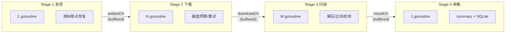
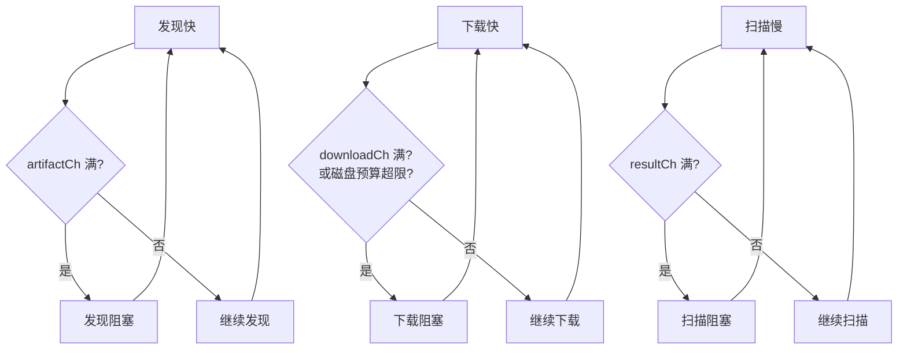
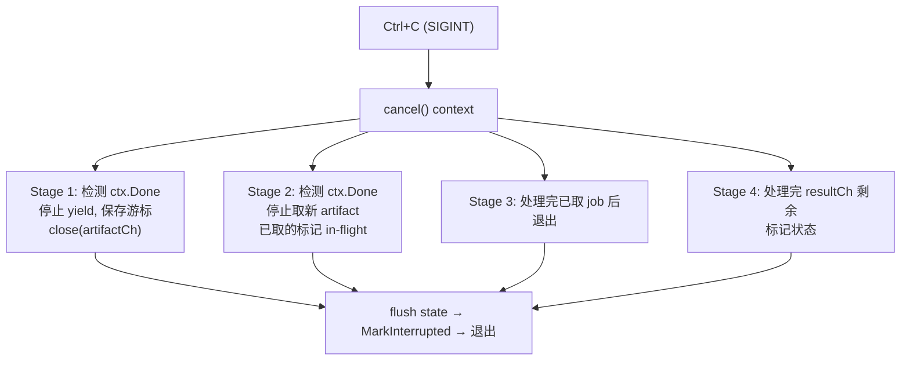

# 四阶段流水线

`mvn-repo-scanner` 的扫描引擎是一个**四阶段并发流水线**，用 Go goroutine + channel 连接，实现发现、下载、扫描、收集的并行处理。

## 流水线全景



## Stage 1：发现（Discovery）

1 个 goroutine，用[游标遍历器](./cursor)遍历仓库目录树，把发现的 artifact 通过 `artifactCh` 投递给下游。

```go
go func() {
    defer close(artifactCh)
    s.discoverStreaming(ctx, artifactCh, summary)
}()
```

- **游标断点**：每扫 `checkpoint-interval` 个 artifact 暂停一次，保存游标
- **in-flight 保护**：yield 前 MarkInFlight，保存游标前回退（详见[游标恢复](./cursor)）
- **跳过已完成**：`IsCompleted(path)` 为 true 的不投递
- **可恢复**：resume 时从持久化游标继续

`artifactCh` 是**有缓冲**通道（`dlConcurrency*2`），发现快而下载慢时会被背压阻塞，避免 OOM。

## Stage 2：下载（Download）

N 个 goroutine（`--concurrency` 或 `--download-concurrency`）从 `artifactCh` 取 artifact，下载到本地临时文件。

```go
for artifact := range artifactCh {
    state.MarkInFlight(artifact.Path())
    // 磁盘预算
    diskWatcher.Acquire(0)
    // 下载（带重试）
    dlResult, err := downloader.Download(ctx, artifact)
    // 投递给扫描阶段
    downloadCh <- downloadJob{artifact, dlResult}
}
```

- **并发数**：`--download-concurrency`（0 时回退到 `--concurrency`，默认 10）。下载是 IO 密集，通常调高以掩盖网络延迟
- **限速**：`--qps` 控制每秒最大请求数，避免压垮仓库
- **重试**：`--retries`（默认 3）。只重试临时错误（5xx/429/网络抖动），404 等永久错误立即失败；429 解析 `Retry-After`，退避加 jitter
- **连接复用**：`http.Transport` 的 `MaxIdleConnsPerHost` 调到 64，单 host 仓库并发下载复用 TCP/TLS 连接
- **磁盘预算**：`--disk-budget`（默认 1GB）限制临时文件总量，超限时阻塞下载等待扫描消费（背压）
- **认证**：私服的 Basic Auth / Bearer Token 在此阶段生效
- **大文件保护**：`--max-file-size`（默认 50MB）跳过过大的文件

下载失败时直接产生一个 `StatusFailed` 结果投递到 `resultCh`，不进入扫描阶段。

## Stage 3：扫描（Scan）

M 个 goroutine（`--scan-concurrency`，0 时回退到 `--concurrency`）从 `downloadCh` 取已下载的文件，解压并检测敏感内容。扫描是 CPU 密集，建议设为 CPU 逻辑核数。

```go
for job := range downloadCh {
    s.processJob(ctx, job, resultCh)
}
```

`processJob` 内部：

1. **判断文件类型**：
   - `.jar` / `.war` / `.ear` → 解压，扫描内部文本文件
   - `.pom` / `.xml` / `.properties` 等 → 直接扫描
   - `.class` / `.so` / 二进制 → 跳过
2. **逐文件检测**：对每个文本文件应用启用的规则集（`detector.Detect`）
3. **收集 findings**：命中的规则、严重级别、文件路径、行号、匹配内容
4. **投递结果**：`ArtifactResult{Artifact, Status, Findings}` 到 `resultCh`

- **规则集**：`--rules-level` 选择 core/extended/all
- **自定义规则**：`--rules` 指定 YAML
- **panic 安全**：单个文件扫描 panic 不会崩溃整个流水线，记为 failed

## Stage 4：收集（Collector）

1 个 goroutine（主 goroutine）从 `resultCh` 读取所有结果，汇总统计、调用回调、写 SQLite。

```go
for result := range resultCh {
    if result.Status == StatusComplete {
        summary.TotalScanned++
        summary.AddFindings(result.Findings)
    } else {
        summary.TotalFailed++
    }
    s.onResult(result)        // 用户回调（更新 state、写报告）
    store.UpsertRecord(...)   // 写 SQLite
}
```

- **状态更新**：通过 `OnResult` 回调，调用 `MarkCompleted` / `MarkFailed`（同时从 in-flight 集合移除）
- **SQLite 写入**：每个 artifact 的扫描记录 + findings 写入数据库
- **缓存清理**：每 50 个结果触发一次缓存清理（`EnforceCacheLimit`）
- **报告生成**：累积 findings 到内存报告对象

## 背压与流控

通道都带缓冲，形成天然背压链：



这样每个阶段都不会无限堆积数据，内存占用可控。磁盘预算（`--disk-budget`）提供额外的硬性流控——临时文件超限时下载暂停，等扫描消费释放空间。

## 中断与优雅退出



关键点：
- **强制 flush**：即使 `checkpoint-interval` 未满，信号也会触发立即 flush 全部状态
- **in-flight 保留**：未完成的 artifact 留在 in-flight 集合，resume 时重新处理
- **游标回退**：flush 时游标回退到 in-flight 之前（详见[游标恢复](./cursor)）

## 并发配置建议

下载（IO 密集）与扫描（CPU 密集）的最优并发数通常不同。`--scan-concurrency` 让两者独立调优：

| 场景 | download-concurrency | scan-concurrency | qps | disk-budget |
|------|----------------------|------------------|-----|-------------|
| Maven Central 小范围 | 5-10 | CPU 核数 | 0 | 默认 |
| Maven Central 大范围 | 3-5 | CPU 核数 | 10-20 | 1000 |
| 私服（友好） | 5-10 | CPU 核数 | 0 | 1000 |
| 私服（限流严格） | 2-3 | CPU 核数 | 5 | 500 |

::: tip 别太激进
并发过高会被仓库限流（429）或拖慢服务器，反而更慢。`--qps` 是更精确的限速手段。扫描并发设为 CPU 逻辑核数即可——解压+正则是纯 CPU，再高只会增加上下文切换开销。
:::

## 下载层的并发优化

下载阶段针对单 host Maven 仓库做了三项优化：

- **连接池调优**：`http.Transport` 的 `MaxIdleConnsPerHost` 从默认 2 调到 32-64，让并发下载真正复用 TCP/TLS 连接，避免每次请求重新握手。
- **错误感知重试**：只重试临时错误（5xx、429、网络抖动），404/403 等永久错误立即失败，不浪费重试预算与 QPS 配额。429 解析 `Retry-After` 头，退避加随机抖动（jitter）避免多 worker 同步重试造成 thundering herd。
- **磁盘预算背压**：`DiskWatcher` 在临时文件总量逼近 `--disk-budget` 时阻塞下载、等待扫描消费释放空间，唤醒通道扩容消除旧的 500ms 轮询延迟。

## 性能特征

- **CPU 密集**在 Stage 3（解压 + 检测），用 `--scan-concurrency` 调到 CPU 核数
- **IO 密集**在 Stage 2（下载），用 `--download-concurrency` 调高掩盖网络延迟
- **内存**主要受 channel 缓冲与磁盘预算影响，流式发现使其保持常数级

## 相关代码

- `internal/scanner/scanner.go` 的 `Run` — 流水线编排
- `internal/repo/downloader.go` — 下载与重试
- `internal/scanner/scanner.go` 的 `processJob` — 解压与扫描

## 下一步

- [敏感内容检测](./detection) — Stage 3 的规则引擎细节
- [持久化与任务管理](./persistence) — Stage 4 的 SQLite 写入
